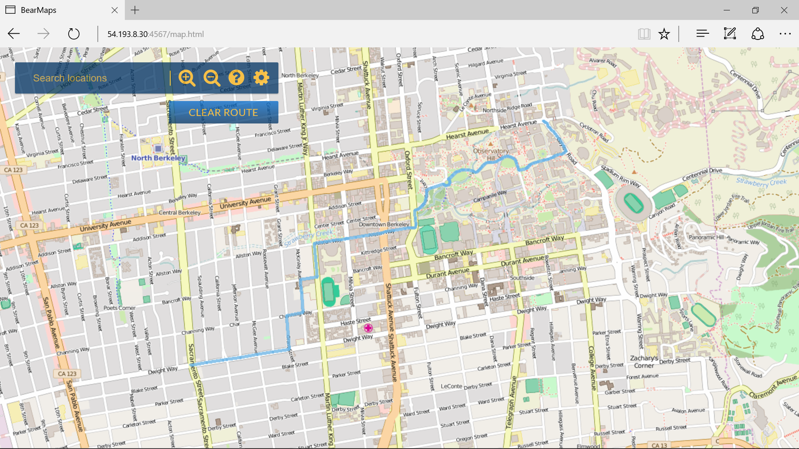

# <h1>BearMaps, version 3.0 </h1>

## Overview
This is a web mapping application of berkeley. The interface will support scrolling, zooming, and route finding (similar to Google Maps).

## Features
### Capture

### shortest path finding

## Contributing
Implemented the back-end